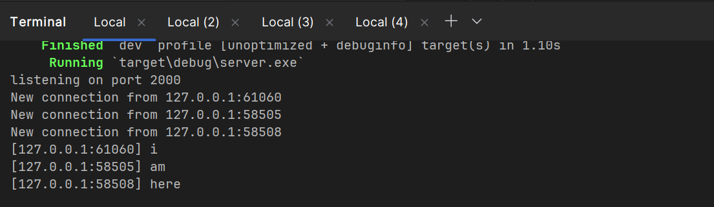
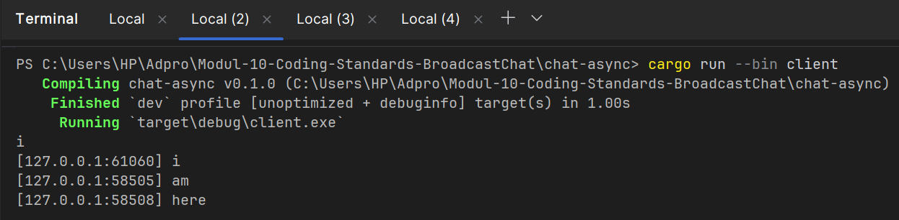
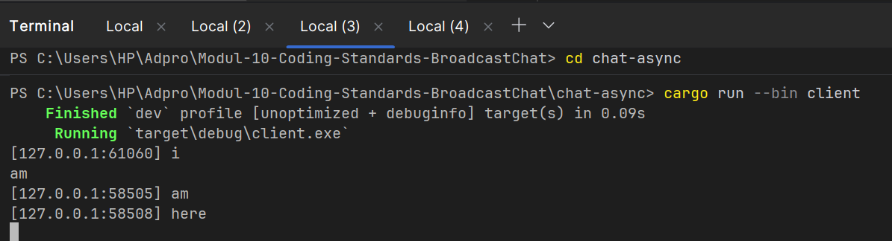
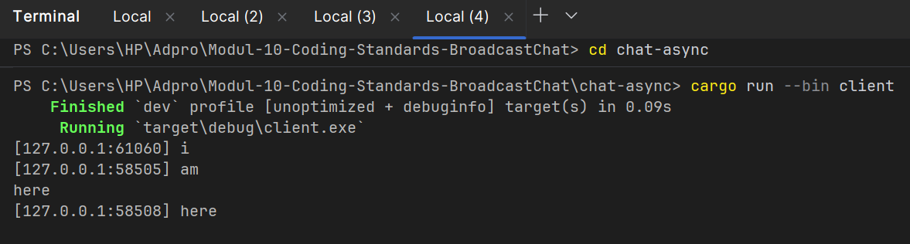

## Experiment 2.1:
Image from server:

Image from three consecutive clients:

How to run:
- Generate a server with cargo run --bin server
- Generate a client with cargo run --bin client (generate three of them)
- Type something on each created client

Explanation: 

This experiment demonstrates a broadcast chat system built with Rust's async/await patterns and WebSocket communication. The server (visible in the first image) initializes a TCP listener on port 2000 and uses Tokio's broadcast channel to handle multiple concurrent client connections. When the server starts, it prints "listening on port 2000" and waits for incoming WebSocket connections, managing them with async tasks spawned for each new client. Each subsequent image shows a different client connecting to the server and typing messages ("i", "am", and "here") sequentially, with each message being received and processed by the server. The server's `handle_connection` function uses `tokio::select!` macro to concurrently manage two operations: receiving messages from clients via stdin and broadcasting them to all other connected clients through the broadcast channel. When a client sends a message, the server prefixes it with the client's IP address and port, then broadcasts this formatted message to all subscribed clients in real-time. The three client screenshots demonstrate the system's ability to maintain multiple persistent connections simultaneously, where each client can both send and receive messages, creating a true broadcast chat experience where all connected clients see messages from all other participants. This showcases async Rust concepts including concurrent I/O multiplexing, multi-producer broadcast channels, and proper resource cleanup when clients disconnect.

