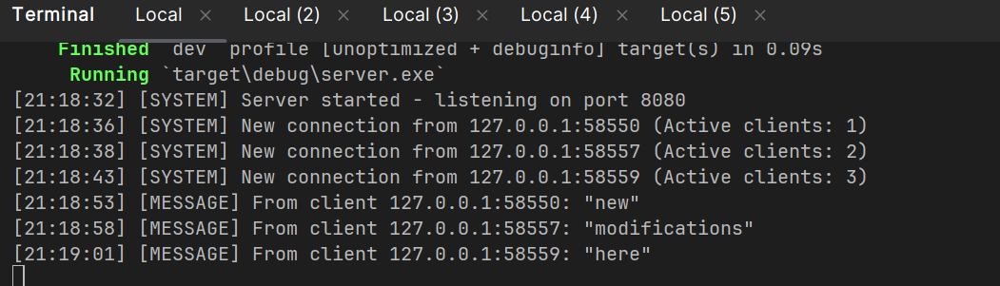
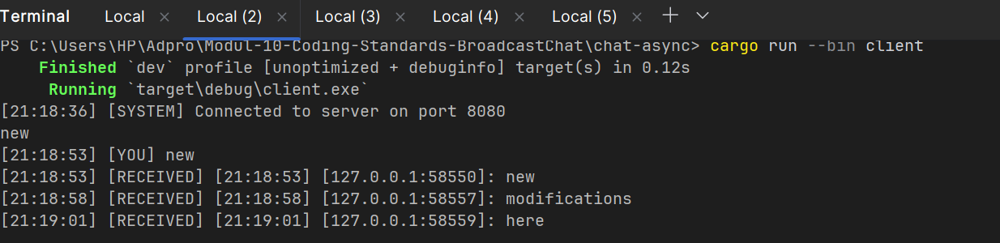
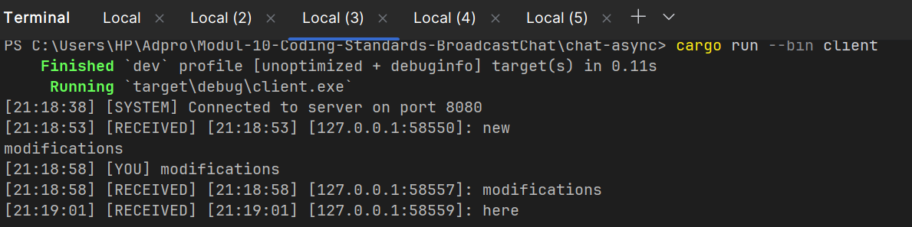
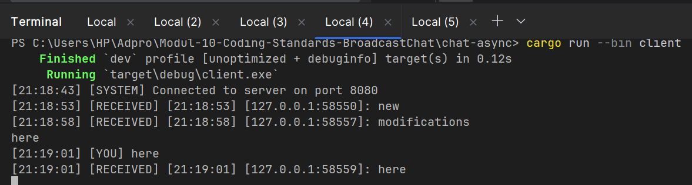

## Experiment 2.1:
Image from server:


Image from three consecutive clients:


How to run:
- Generate a server with cargo run --bin server
- Generate a client with cargo run --bin client (generate three of them)
- Type something on each created client

Explanation: 

This experiment demonstrates a broadcast chat system built with Rust's async/await patterns and WebSocket communication. The server (visible in the first image) initializes a TCP listener on port 2000 and uses Tokio's broadcast channel to handle multiple concurrent client connections. When the server starts, it prints "listening on port 2000" and waits for incoming WebSocket connections, managing them with async tasks spawned for each new client. Each subsequent image shows a different client connecting to the server and typing messages ("i", "am", and "here") sequentially, with each message being received and processed by the server. The server's `handle_connection` function uses `tokio::select!` macro to concurrently manage two operations: receiving messages from clients via stdin and broadcasting them to all other connected clients through the broadcast channel. When a client sends a message, the server prefixes it with the client's IP address and port, then broadcasts this formatted message to all subscribed clients in real-time. The three client screenshots demonstrate the system's ability to maintain multiple persistent connections simultaneously, where each client can both send and receive messages, creating a true broadcast chat experience where all connected clients see messages from all other participants. This showcases async Rust concepts including concurrent I/O multiplexing, multi-producer broadcast channels, and proper resource cleanup when clients disconnect.

## Experiment 2.2: Changing the Port Configuration

In order to change the port to 8000 (or any other desired port), you need to modify the port number in two locations within the codebase. First, open the `chat-async/src/bin/server.rs` file and locate line 67 where `TcpListener::bind("127.0.0.1:8080")` is defined, then change `8080` to your desired port number (e.g., `8000`). Similarly, update the client configuration in `chat-async/src/bin/client.rs` at line 11 where the connection URI is specified as `Uri::from_static("ws://127.0.0.1:8080")`, changing `8080` to match your new port. After making these changes in both files, rebuild the project using `cargo build --release` or simply run the binaries with `cargo run --bin server` and `cargo run --bin client` commands, which will automatically recompile with the new port settings.

### WebSocket Protocol Details

Yes, both sides of this chat system (Server and client) uses the same **WebSocket protocol**, which is defined and managed by the `tokio-websockets` crate (version 0.13.2) specified in `Cargo.toml`. The WebSocket protocol is a standardized protocol (RFC 6455) that enables full-duplex bidirectional communication over a single TCP connection, which is ideal for real-time applications like this chat system. In the server code (`server.rs`), the WebSocket connection is established at line 76 using `ServerBuilder::new().accept(socket).await?`, which upgrades the initial TCP connection to a WebSocket connection by performing the necessary HTTP upgrade handshake. The client similarly initiates a WebSocket connection at lines 10-13 in `client.rs` using `ClientBuilder::from_uri(Uri::from_static("ws://127.0.0.1:8080")).connect().await?`, where the `ws://` URI scheme indicates it's using an unencrypted WebSocket protocol (as opposed to `wss://` for secure WebSocket connections over TLS). The actual message handling using the WebSocket protocol is abstracted by the `tokio-websockets` crate, which provides convenient methods like `Message::text()` for sending text frames (line 24 in client and line 46 in server) and `msg.is_text()`, `msg.is_close()` checks for receiving different message types, all following the WebSocket frame format specification. 


## Experiment 2.3: Output Enhancement with Timestamps, Client Counter, and Message Distinction

### Modifications made (Other than adding IP and Port info):

#### 1. **Added Timestamps with GMT+7 Timezone**

Both `server.rs` and `client.rs` now include a `get_timestamp()` function that displays the current time in GMT+7 timezone format (HH:MM:SS). The function retrieves the current system time in UTC and adds 7 hours (7 × 3600 seconds) to adjust for the GMT+7 timezone.

**Why this was added:** Timestamps are crucial for debugging and tracking the sequence of events in a real-time chat system. They provide temporal context for when messages were sent, received, or when clients connected/disconnected, making it easier to understand the flow of communication and identify timing-related issues. GMT+7 adjustment ensures that log entries match the local time zone where the application is running.

**Code implementation:**
```rust
fn get_timestamp() -> String {
    let now = SystemTime::now()
        .duration_since(SystemTime::UNIX_EPOCH)
        .unwrap()
        .as_secs();
    // Add 7 hours for GMT+7 timezone
    let adjusted_time = now + (7 * 3600);
    let hours = (adjusted_time % 86400) / 3600;
    let minutes = (adjusted_time % 3600) / 60;
    let seconds = adjusted_time % 60;
    format!("{:02}:{:02}:{:02}", hours, minutes, seconds)
}
```

#### 2. **Added Client Counter on Server**

The server now uses `Arc<AtomicUsize>` to maintain a thread-safe counter of active client connections. When a new client connects, the counter increments, and when a client disconnects, it decrements. This counter is displayed in server console output whenever a client connects or disconnects.

**Why this was added:** A client counter provides real-time visibility into the state of the broadcast chat system. System administrators and developers can quickly see how many clients are currently connected, which is important for monitoring server load, debugging connection issues, and understanding chat room occupancy. This metric is essential for managing multi-user systems and ensuring the server isn't overwhelmed.

**Key changes in `server.rs`:**
- Added imports: `use std::sync::atomic::{AtomicUsize, Ordering}; use std::sync::Arc;`
- Modified `handle_connection()` function signature to accept `client_count: Arc<AtomicUsize>`
- Incremented counter on new connection: `client_count.fetch_add(1, Ordering::SeqCst);`
- Decremented counter on disconnection: `client_count.fetch_sub(1, Ordering::SeqCst);`
- Display format: `"[SYSTEM] New connection from {} (Active clients: {})"`

#### 3. **Distinguished Sent vs Received Messages on Client**

The client now displays different message type indicators to distinguish between user-sent messages and server-received messages. Sent messages are prefixed with `[YOU]` while received messages are prefixed with `[RECEIVED]`. This makes it immediately clear which messages the current user typed versus which messages came from other clients or the server.

**Why this was added:** In a multi-client chat environment, users need clear visual separation between their own messages and messages from other participants. Without this distinction, the chat output becomes confusing, especially when multiple messages arrive in quick succession. The `[YOU]` and `[RECEIVED]` labels provide immediate context, improving user experience and reducing confusion about message ownership.

**Example output differences:**
- Before: `hello` (ambiguous)
- After: `[YOU] hello` (sent by current user) vs `[RECEIVED] [127.0.0.1:12345]: hello` (received from another client)

**Key changes in `client.rs`:**
- Modified sent message output: `println!("[{}] [YOU] {}", timestamp, msg);`
- Modified received message output: `println!("[{}] [RECEIVED] {}", timestamp, text);`
- All system messages tagged with `[SYSTEM]` for consistency
- All error messages tagged with `[ERROR]` for quick identification

#### 4. **Overall Output Format Improvement**

All console output now follows a structured format: `[TIMESTAMP] [MESSAGE_TYPE] Content`, which provides consistency and makes parsing easier for automated log analysis.

**Message type categories:**
- `[SYSTEM]` - Connection/disconnection events and server status
- `[MESSAGE]` - Chat messages (server-side)
- `[YOU]` - Messages sent by the current client
- `[RECEIVED]` - Messages received from other clients
- `[ERROR]` - Error conditions

**Why this was added:** Structured output formatting makes the system more professional and easier to work with. It enables quick visual scanning of logs, makes it easier to filter different types of events, and provides a foundation for integrating with automated log aggregation tools. The consistency also improves code maintainability as all developers understand the output format immediately.

### Summary of Benefits

These modifications transform the broadcast chat system from a basic prototype into a more production-ready application by:
1. **Improving debuggability** through timestamped events and structured logging
2. **Enabling real-time monitoring** via the active client counter
3. **Enhancing user experience** with clear message attribution and type categorization
4. **Providing better operational visibility** through consistent, structured output that's suitable for log aggregation and analysis tools

Image of server:


Image of three consecutive clients:



